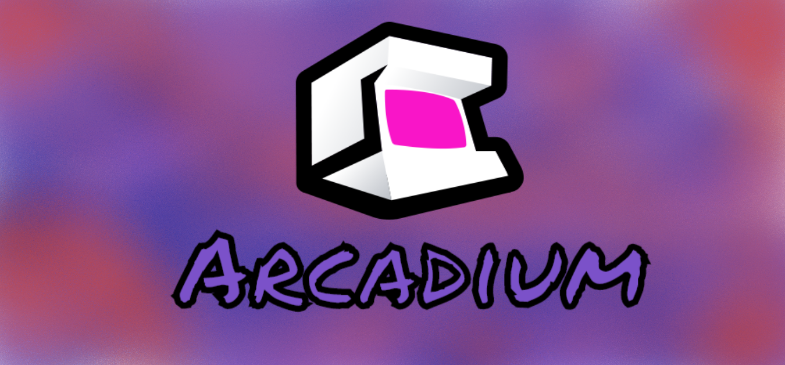

# Bienvenidos a "*Arcadium*" :joystick:

## Integrantes del equipo Dinamita :collision:
* Mendoza Ramirez Luis Antonio
* Romero Lara Rodrigo
* Villafranca Hernández Carlos Iván
## Guia de Instalacion 
### Instalacion Windows 
1. Descargar o clona el repositorio dentro de tu dispositivo
2. [Descarga Xampp](https://www.apachefriends.org/xampp-files/7.4.7/xampp-windows-x64-7.4.7-0-VC15-installer.exe) en la version 7.4.7
3. Situa la carpeta "ProyectoJS-CSS" o equivalente* dentro de la carpeta "Xampp/htdocs"
4. Activa "Apache" en el Panel de Control de Xampp (para avilitar las cookies :cookie:)
5. Ingresa a tu navegador de preferencia 
6. Inserta en la barra de navegacion la ruta "http://localhost/ProyectoJS-CSS/" o equivalente*
7. Disfruta de la experiencia !!
*(dependiendo del nombre de tu carpeta donde guardaste el proyecto)

## Guia de Configuracion
* Avilitar el uso de cookies en tu navegador 

## Características del proyecto

* La pagina cuenta con 3 juegos diseñados desde 0
  * Buscaminas
  * Space Invaders
  * Tetris
* Se puede acceder a cada juego atraves de la ficha que hay de ellas
* Hay una pagina de Inicio que te muestra novedades e informacion actual
* Puedes personalizar tu pagina con las 3 paletas existentes (*Morado espacial*, *Azul oceanico*, *Naranja Volcanico*)
* Se cuenta con un logo en el banner y el favicon 
* Se cuenta con transiciones en la pagina 
* El 90% de la pagina cuenta con Estilo Original
* Se cuenta con animacion en la barra de navegación
* Facil accesibilidad a las diferentes páginas
* Uso de las librerias 
  * Font awesome 
  * JQuery
  * Bootstrap
* Creditos modales

### Caracteristicas de cada juego 
  #### Buscaminas
  * Hay 3 modalidades de juego preestablecidas
  * Se puede crear una partida personalizada
  * Al hacer click en una casilla en vacia se desbloquean el resto adyacentes
  * Se guarda el estado de juego aunque cambies de vista
  
  #### Space Invaders
  * Movimiento y disparo a traves de las teclas "W-A-S-D"
  * Diseño moderno e implementacion de canvas
  * Enemigos contraatacan tus disparos
  * Gran cantidad de enemigos a combatir
  
  #### Tetris
  * Cuenta con movimientos atraves de las flechas de direccion
  * Posee música que puede ser pausada
  * Sonidos en movimientos y eventos especiales
  * Aumento de velocidad respecto a las filas destruidas
  
## Comentarios adicionales
Buscamos que tuviera una tematica de juegos "antiguos" para mostrar que es un arcade moderno.

Las paletas de colores estan pensadas para personalidades diferentes de gamer:
   * El *Morado espacial* busca representar a esos jugadores más clásicos y conocedores de los juegos, por eso la rima entre especial y espacial
   * El *Azul oceanico* busca mostrar a esos jugadores mas tránquilos pero a su vez tiene gran confianza en sus habilidades y lo demuestran a la hora de juagra
   * El *Naranja Volcánico* representa a esos jugadores apasionados que juegan de forma vigoroza e energetica, siempre buscan ser los mejores entre los demas.
   
Disfruten  nuestra página, no es tal vez mucho pero es trabajo honesto, cada uno se esforzó en su juego y buscamos implementar lo que pudimos en este tiempo
   
  
